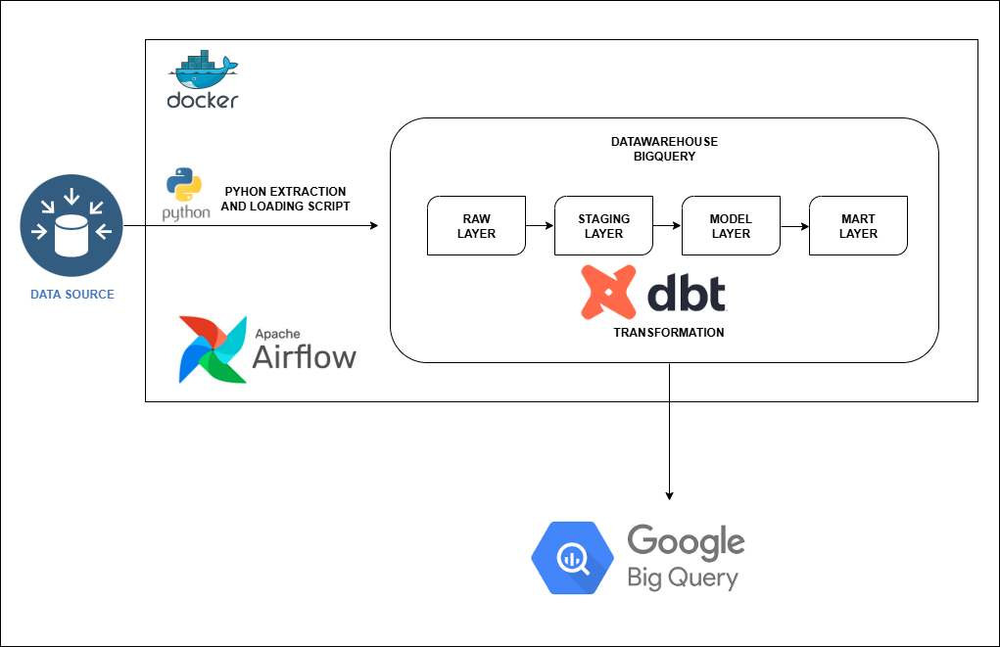
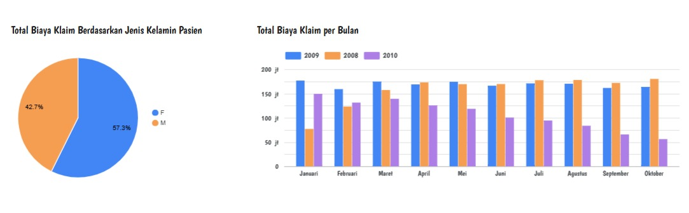

# Capstone Project Modul 3: Medical Claims Data Pipeline

## Tujuan Proyek (Business Case)

Proyek ini bertujuan untuk membangun sebuah pipeline data end-to-end yang sepenuhnya otomatis untuk menganalisis total biaya klaim medis. Analisis ini didasarkan pada demografi pasien (jenis kelamin) serta tren waktu. Hasil analisis ini akan divisualisasikan melalui dashboard untuk memberikan wawasan yang dapat membantu pengambilan keputusan.

## Arsitektur Sistem

Pipeline ini dirancang dengan pendekatan Extract, Load, Transform (ELT) dan diorkestrasi menggunakan Apache Airflow. Data mengalir melalui beberapa tahapan yang terstruktur:

1. Sumber Data: Data klaim medis diunduh secara programatis.
2. Raw Layer (BigQuery): Data mentah disimpan tanpa modifikasi.
3. Staging Layer (BigQuery): Data dibersihkan dan distandarisasi menggunakan dbt.
4. Model Layer (BigQuery): Data ditransformasi menjadi model data bintang (star schema) yang terdiri dari tabel fakta dan dimensi.
5. Mart Layer (BigQuery): Data diagregasi untuk kebutuhan dashboard yang spesifik.
6. Dashboard: Data dari layer mart digunakan untuk visualisasi di Looker Studio.
7. Orkestrasi: Seluruh alur kerja diotomatisasi menggunakan Apache Airflow.

## Sumber Data

Proyek ini menggunakan dataset MedicalClaimsSynthetic1M.csv yang diperoleh dari Kaggle. Proses pengunduhan data ke folder lokal dilakukan secara programatis menggunakan skrip Python (download_kaggle_data.py), yang kemudian dimuat ke dalam layer raw BigQuery melalui skrip ingest_to_bigquery.py.

## Transformasi Data (DBT)

DBT (Data Build Tool) digunakan untuk semua proses transformasi data di dalam BigQuery. Terdapat beberapa model yang dibuat:

* **Model Staging (stg_cms_claims.sql):** Membersihkan, menstandardisasi nama kolom, dan menghitung total_claim_cost dari data mentah. Model ini juga menyaring data dengan biaya klaim negatif.

* **Model Dimensi:**

    * dim_patient.sql: Membuat tabel dimensi pasien yang berisi informasi unik tentang demografi seperti usia, jenis kelamin, dan lokasi.

    * dim_date.sql: Membuat tabel dimensi tanggal untuk analisis berbasis waktu.

* **Model Fakta (fct_claims.sql):** Tabel fakta yang berisi metrik biaya klaim dan kunci-kunci untuk terhubung ke tabel dimensi.

* **Model Mart:**

    * monthly_claim_summary.sql: Tabel agregasi yang merangkum total biaya klaim per bulan berdasarkan demografi.

    * demographic_claim_summary.sql: Tabel agregasi yang merangkum total biaya klaim per kelompok usia dan wilayah.

* **Data Quality Checks:** Kami juga mengimplementasikan tes kualitas data menggunakan dbt test dan paket dbt_expectations untuk memastikan integritas dan akurasi data.

## Orkestrasi (Airflow)

Seluruh pipeline diotomatisasi menggunakan Apache Airflow dengan konfigurasi Docker. Alur kerja (DAG) terdiri dari serangkaian tugas yang berjalan secara berurutan:

* **download_data_task:** Mengunduh data dari Kaggle.

* **ingest_data_task:** Memuat data ke BigQuery.

* **run_dbt_models_task:** Menjalankan semua model dbt untuk transformasi data.

* **run_dbt_tests_task:** Menjalankan tes kualitas data.

Selain itu, DAG juga dilengkapi dengan notifikasi ke Discord yang akan terpicu jika ada tugas yang gagal.

## Hasil Analisis (Dashboard)

Dashboard yang dibangun di Looker Studio menyajikan visualisasi data yang komprehensif, termasuk:

* Grafik garis yang menunjukkan tren total biaya klaim dari bulan ke bulan.

* Bagan lingkaran yang memvisualisasikan total biaya klaim berdasarkan jenis kelamin pasien.

# ##Instruksi Setup
Untuk menjalankan proyek ini, ikuti langkah-langkah berikut:

Clone repositori ini: git clone [URL_REPOSITORI_ANDA]

Pastikan Docker sudah terinstal.

Konfigurasi docker-compose.yml dengan path yang sesuai.

Jalankan docker-compose up -d --build --force-recreate.

Akses Airflow UI di http://localhost:8080, aktifkan DAG elt_cms_claims_dag, dan jalankan secara manual.