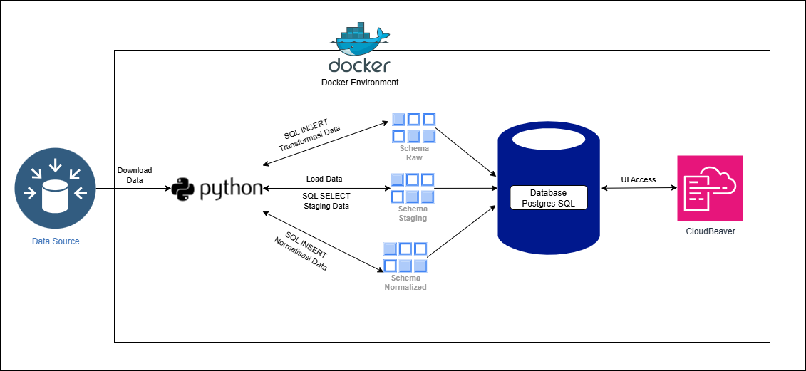
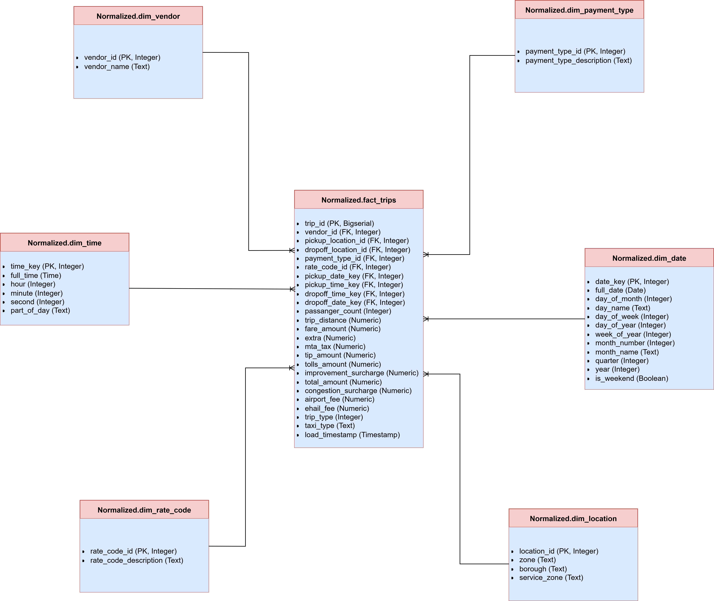

# Capstone Project Module 2: NYC Taxi Data Engineering Pipeline

## Daftar Isi
1.  [Pendahuluan](#1-pendahuluan)
2.  [Fitur & Teknologi](#2-fitur--teknologi)
3.  [Arsitektur Proyek](#3-arsitektur-proyek)
4.  [Cara Menjalankan Pipeline Data](#6-cara-menjalankan-pipeline-data)
5.  [Model Data Normalized (ER Diagram)](#7-model-data-normalized-er-diagram)
6.  [Proses Normalisasi Data (Per Normal Form)](#8-proses-normalisasi-data-per-normal-form)

---

## 1. Pendahuluan

Proyek Capstone Modul 2 ini adalah implementasi *pipeline* Data Engineering end-to-end yang berfokus pada ekstraksi, pemuatan, transformasi, dan normalisasi data perjalanan taksi New York City (NYC). Proyek ini dirancang untuk mengaplikasikan pengetahuan SQL, Relational Database Management System, dan prinsip-prinsip pengembangan perangkat lunak (OOP, modularitas) dalam skenario dunia nyata.

Data yang digunakan adalah dataset perjalanan taksi Yellow dan Green dari NYC Taxi & Limousine Commission (TLC), serta data *lookup* zona taksi.

## 2. Fitur & Teknologi

* **Ekstraksi & Pemuatan Data:** Mengunduh file data Parquet/CSV dari URL dan memuatnya secara efisien ke database PostgreSQL.
* **Transformasi Data (SQL Murni):** Pembersihan, standardisasi, dan konsolidasi data dari skema `staging` ke skema `raw` sepenuhnya menggunakan sintaks SQL yang dieksekusi dari Python.
* **Normalisasi Data (SQL Murni):** Normalisasi data hingga Third Normal Form (3NF) dari skema `raw` (dan `staging` untuk lokasi) ke skema `normalized` menggunakan SQL yang dieksekusi dari Python, menghasilkan struktur Star Schema.
* **Manajemen Database:** Menggunakan PostgreSQL sebagai database relasional.
* **Orkestrasi & Kontainerisasi:** Seluruh *pipeline* dijalankan dalam lingkungan Docker menggunakan skrip Python (OOP).
* **Reusability & Resilience:**
    * Kode Python yang modular, berorientasi objek (OOP), dan parameterized.
    * Setiap *run* memproses satu file secara *end-to-end* untuk memastikan idempotensi (menghindari duplikasi data).
    * Penanganan error yang robust.
* **Alat Bantu:**
    * **Docker:** Untuk kontainerisasi PostgreSQL dan aplikasi Python.
    * **Python:** Bahasa pemrograman utama untuk orkestrasi dan interaksi database.
    * **SQL (PostgreSQL Dialect):** Untuk transformasi dan normalisasi data.
    * **SQLAlchemy:** ORM Python untuk berinteraksi dengan database.
    * **Pandas:** Untuk membaca file Parquet/CSV ke DataFrame sebelum loading awal.
    * **CloudBeaver:** Database *browser* berbasis web untuk akses dan monitoring database.

## 3. Arsitektur Proyek

Proyek ini mengikuti arsitektur ELT (Extract, Load, Transform) yang dikontainerisasi, di mana data dimuat ke *staging area* sebelum transformasi dan normalisasi.



## 4. Cara Menjalankan Pipeline Data

* **Bangun dan Jalankan Docker Compose:**
    Perintah ini akan membuat dan menjalankan kontainer PostgreSQL serta kontainer aplikasi Python Anda. Kontainer PostgreSQL akan otomatis membuat skema `staging`, `raw`, dan `normalized` saat pertama kali dijalankan.
    ```bash
    docker compose up -d --build
    ```
    `-d`: Menjalankan kontainer di latar belakang (detached mode).

    Skrip `main.py` dirancang untuk memproses satu file data *end-to-end* (Ekstraksi, Pemuatan, Transformasi, Normalisasi) per panggilan. Anda akan menjalankannya melalui kontainer Docker `ny_taxi_data_processor`.

* **Sintaks Umum:**
    ```bash
    docker compose run --rm data_processor python app/main.py --type <taxi_type_or_lookup> --year <year> --month <month>

    --rm: Menghapus kontainer setelah eksekusi selesai.
    data_processor: Nama layanan kontainer aplikasi Python dari docker-compose.yaml.
    python app/main.py: Menjalankan skrip Python utama.
    --type: Jenis data (misal: yellow_taxi, green_taxi, taxi_zone_lookup).
    --year: Tahun data (hanya untuk yellow_taxi dan green_taxi).
    --month: Bulan data (hanya untuk yellow_taxi dan green_taxi).

## 5. Model Data Normalized (ER Diagram)

Data di skema normalized diatur dalam struktur Star Schema untuk optimalisasi analisis dan pelaporan. Tabel fact_trips adalah tabel fakta pusat, terhubung ke berbagai tabel dimensi yang menyimpan atribut deskriptif unik.


## 6. Proses Normalisasi Data (Per Normal Form)

Proses normalisasi bertujuan untuk mengurangi redundansi data dan meningkatkan integritas data. Berikut adalah tahapan normalisasi yang diterapkan pada data perjalanan taksi:

0. Kondisi Awal (Tabel Denormalisasi)
Data awal di raw.all_taxi_trips_raw adalah tabel lebar yang mengandung banyak detail perjalanan dalam satu baris, dengan potensi redundansi untuk atribut yang bergantung pada ID tertentu (misalnya, deskripsi vendor, zona lokasi).

1. First Normal Form (1NF)
Definisi: Setiap kolom berisi nilai tunggal (atomik) dan tidak ada grup berulang. Setiap baris unik.

Penerapan: Data yang dimuat ke skema raw sudah memenuhi 1NF. Proses parsing file Parquet/CSV dan penanganan konsolidasi kolom pickup_datetime/dropoff_datetime memastikan atomisitas dan tidak adanya grup berulang.

2. Second Normal Form (2NF)
Definisi: Sudah dalam 1NF, dan semua atribut non-kunci sepenuhnya bergantung pada seluruh Primary Key.

Penerapan: Tabel raw.all_taxi_trips_raw memiliki Primary Key komposit yang besar. Atribut seperti zone, borough (yang bergantung hanya pada location_id), atau deskripsi payment_type (yang bergantung hanya pada payment_type_id) merupakan partial dependency. Untuk mengatasi ini, atribut-atribut ini dipindahkan ke tabel dimensi terpisah (dim_location, dim_vendor, dim_payment_type, dim_rate_code, dim_date, dim_time), di mana setiap atribut non-kunci di tabel dimensi tersebut sepenuhnya bergantung pada Primary Key tabel dimensi itu sendiri.

3. Third Normal Form (3NF)
Definisi: Sudah dalam 2NF, dan tidak ada transitive dependency (tidak ada atribut non-kunci yang bergantung pada atribut non-kunci lainnya).

Penerapan: Dengan pemisahan ke tabel-tabel dimensi, kami memastikan bahwa semua atribut non-kunci di setiap tabel dimensi secara langsung bergantung pada Primary Key tabel dimensi tersebut. Tabel fact_trips kemudian menyimpan metrik perjalanan dan Foreign Key ke tabel-tabel dimensi, memastikan bahwa semua metrik secara langsung bergantung pada kombinasi Foreign Key yang membentuk Primary Key tabel fakta. Ini secara efektif menghilangkan ketergantungan transitif.